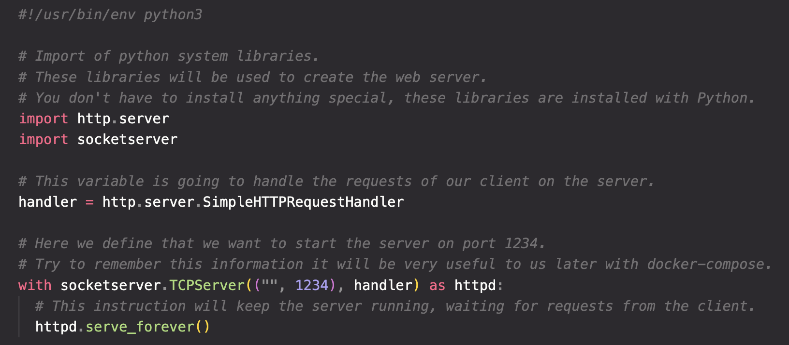
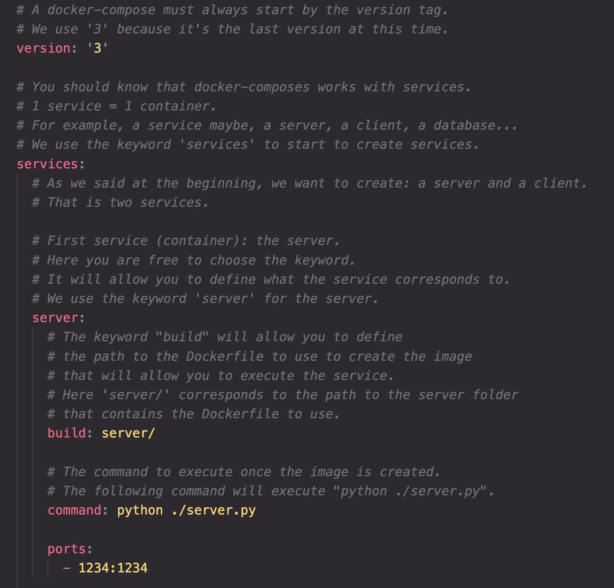
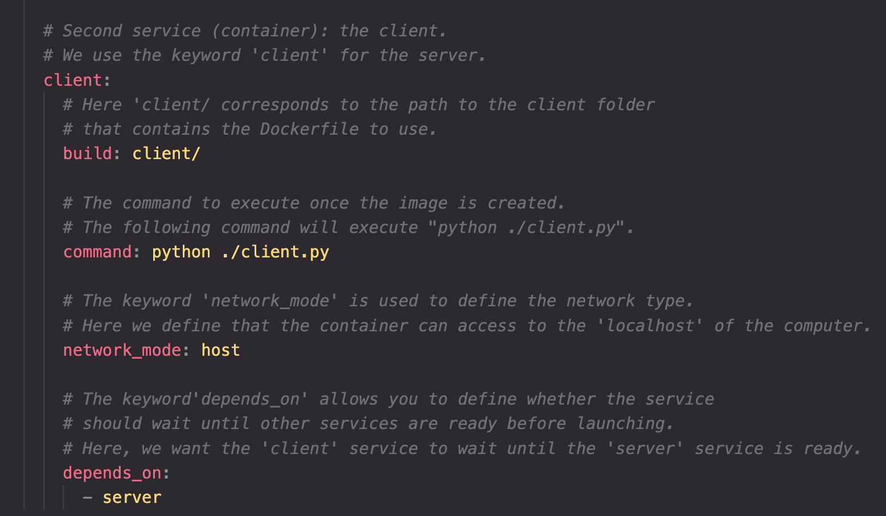

# 1. Create your project

To create your first client/server application, I invite you to create a folder on your computer. It must contain at root the following file and folders:

- A docker-compose.yml file (docker-compose file that will contain the necessary instructions to create the different services).

- A server folder (this folder will contain the files necessary to set up the server).

- A client folder (this folder will contain the files necessary to set up the client).

Normally you should have this folder architecture:

# 2a. Create your server

Move to your server folder and create the following files:

- A server.py file (python file that will contain the server code).
- An index.html file (html file that will contain the sentence to be displayed).
- A Dockerfile file (docker file that will contain the necessary instructions to create the environment of the server).

Normally you should have this folder architecture in the following path server/:

# 2b. Edit the Python File

You can add the following code to the server.py file:

This code will allow you to create a simple web server inside this folder. It will retrieve the content of the index.html file to share it on a web page.

# 2c. Edit the HTML File

ou can add the following sentence to the `index.html` file:

`Docker-Compose is magic!`

This file will be shared by the server when it is started and this sentence will be displayed.

# 2d. Edit the Docker file

Here we will create a basic Dockerfile that will be in charge of executing our Python file. We will use the official image created to execute Python.

# 3. Create your client

In order to continue with reminders of Docker’s basics, we will create the client.

## 3a. Create files

Move to your client folder and create the following files:

- A client.py file (python file that will contain the client code).
- A Dockerfile file (docker file that will contain the necessary instructions to create - the environment of the client).

Normally you should have this folder architecture in the following path ‘_client/_’:

## 3b. Edit the Python file

You can add the following code to the client.py file:

This code will allow you to get the content of the server web page and to display it.

## 3c. Edit the Dockerfile

As for the server, we will create a basic Dockerfile that will be in charge of executing our Python file.

# 4. Back to docker-compose.yml

As you may have noticed, we have created two different projects, the server, and the client, both with a Dockerfile.

So far nothing has changed from the basics you already know.

Now we are going to edit the `docker-compose.yml` file at the root of the repository.

# 5. Build docker-compose

Once the docker-compose is set up, your client/server application need to be built. This step corresponds to the ‘docker build’ command but applied to the different services:

`docker-compose build`

# 6. Run docker-compose

Your docker-compose is built! Now it’s time to start! This step corresponds to the ‘docker run’ command but applied to the different services:

`docker-compose up`

There you go, that’s it. You should normally see “Docker-Compose is magic!” displayed in your terminal.
